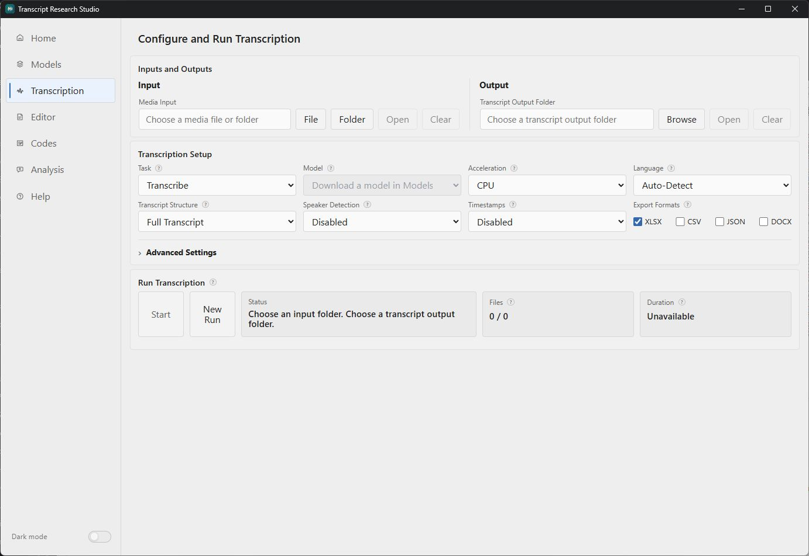

# Transcript Research Studio (beta)

Transcript Research Studio is a local desktop app for researchers who work with recorded interviews or existing transcript files. It brings transcription, transcript correction, qualitative coding, and optional transcript analysis together in one clear and portable desktop interface.

Under the hood, Transcript Research Studio uses [faster-whisper](https://github.com/SYSTRAN/faster-whisper) for local transcription and, optionally, [pyannote.audio](https://github.com/pyannote/pyannote-audio) with the [Community-1 speaker diarization model](https://huggingface.co/pyannote/speaker-diarization-community-1) to distinguish speaker turns. These components are brought together in a straightforward graphical interface, so no programming knowledge or command-line experience is required.

## Who It Is For

Transcript Research Studio is particularly useful for researchers who use qualitative material. It can also support anyone who wants to process recordings locally instead of uploading them to an online transcription or analysis service.

Use the complete workflow from recording to coded material, or only the parts you need. You can also edit or analyze transcripts created elsewhere.

## What You Can Do

### Create transcripts

Select one recording or a folder. The app creates local transcripts as Excel, Word, CSV, or JSON files, with readable paragraphs, timestamped segments, or continuous text.

### Review and correct transcripts

The Transcript Editor lets you correct wording, speaker names, timestamps, and segment boundaries, with optional recording playback. Save a working copy or export cleaned files.

### Code qualitative material

The Codes area lets you select passages, create codes, organize themes, and write notes. Optional local AI assistance can suggest evidence and codes, draft notes, and help draft or refine codebook entries and themes. Suggestions remain under researcher control. Reopen projects later or export them for further work, including optional QDPX Beta exchange with compatible qualitative-analysis tools.

### Analyze transcripts with a local language model

Transcript Analysis can create overviews, research-focused analyses, interview reviews, or reusable custom analyses. It creates separate result files through a local language model and leaves source transcripts unchanged. Results are reviewable research support rather than definitive findings.

### Set up optional local AI assistance

The optional AI features in **Codes** and **Transcript Analysis** use language models provided through [Ollama](https://ollama.com/) or [LM Studio](https://lmstudio.ai/). Transcript Research Studio installs neither providers nor their models. Install one provider, add a suitable local model, and keep its local API running while using AI features.

The app looks for Ollama at `http://127.0.0.1:11434` and LM Studio at `http://127.0.0.1:1234`. Ollama normally provides its API while its application or service is running. In LM Studio, open **Developer**, start the local server, and keep it on port `1234`. Transcript Research Studio then detects the models made available by that provider and sends requests only to the selected local model.

These connections are restricted to `localhost`. The providers do not need to be exposed to the local network or the internet, and the app has no cloud-AI fallback.

### Manage transcription models

Transcription models are managed on the **Models** page. You decide which faster-whisper models to download from Hugging Face and keep locally. Optional speaker recognition can be set up separately when needed.

## A Typical Research Workflow

1. Open **Models** and download a transcription model suitable for your computer.
2. Open **Transcription**, choose one recording or a folder, and create transcript files.
3. Use the **Editor** if the transcripts need correction.
4. Use **Codes** to collect and organize evidence, or use **Transcript Analysis** for a structured local-model analysis.
5. Review the generated files and continue your work in the research tools of your choice.

## Privacy and Local Processing

Transcript Research Studio is built for privacy-sensitive research material.

- Transcription runs on your computer.
- Transcript Analysis uses Ollama or LM Studio running on your computer.
- Source media files stay untouched.
- Source transcript files are not overwritten.
- The app does not add telemetry, analytics, crash uploads, or automatic cloud uploads.
- Internet access is used only when you download transcription and speaker-recognition models.

## Getting Started

Official packages appear on [GitHub Releases](https://github.com/drdiscipulus/transcript-research-studio/releases) after platform qualification.
The packages are:

- **Windows x64 CPU:** the standard option when you do not need NVIDIA acceleration.
- **Windows x64 NVIDIA/CUDA:** for a supported NVIDIA graphics card.
- **Apple Silicon macOS:** for M-series Macs with macOS 12 or later.

Packages are portable: extract the archive, keep its files together, and start the app from that folder. Windows may show a SmartScreen or “unknown publisher” warning because the code is not signed. The macOS package is published with signing and notarization.

Models are not bundled. Download transcription models from **Models**. For Transcript Analysis, install Ollama or LM Studio separately and choose a model there.

Detailed setup and workflow instructions are available in the [User Guide](docs/user_guide.md).

## Version 1.0 Beta 3

The current version is **Version 1.0 Beta 3** (`1.0.0-beta.3`). Core transcription and transcript-editing workflows should be stable and work reliably. The other research features, including coding, codebook management, and Transcript Analysis, are still experimental and may have some rough edges.

Current limitations include (well, it is beta):

- macOS support is limited to Apple Silicon. Intel Macs are not supported.
- Windows packages are not code-signed.
- Ollama and LM Studio are separate applications and are not installed by Transcript Research Studio.
- Transcription and language models require additional local storage and processing time.
- The app is intended for one researcher working with local files, not for shared multi-user projects.
- Generated transcripts and analyses should always be reviewed before they are used as research evidence.

## Documentation

- [User Guide](docs/user_guide.md) — installation, workflows, settings, and troubleshooting
- [Version 1.0 Beta 3 release notes](docs/release_notes_1.0.0-beta.3.md) — supported platforms, language-selection update, beta scope, and current limitations
- [Technical Background](docs/technical_background.md) — architecture, data flow, and security boundaries

## Support and Maintenance

This is a personal side project that I work on in my spare time. I plan to keep improving it, but updates may be occasional and responses to issues or feature requests may take some time.

Use [GitHub Issues](https://github.com/drdiscipulus/transcript-research-studio/issues) for reproducible bugs, documentation problems, or problems with a published package. Include the app version, operating system, and the smallest reproduction you can safely share. Feature requests are welcome as context, but there is no promise that a requested feature will be implemented.

Do not attach private recordings, transcripts, access tokens, or other sensitive research data to an issue.

## License

Transcript Research Studio is open-source software licensed under the [GNU General Public License v3.0 or later](LICENSE).
